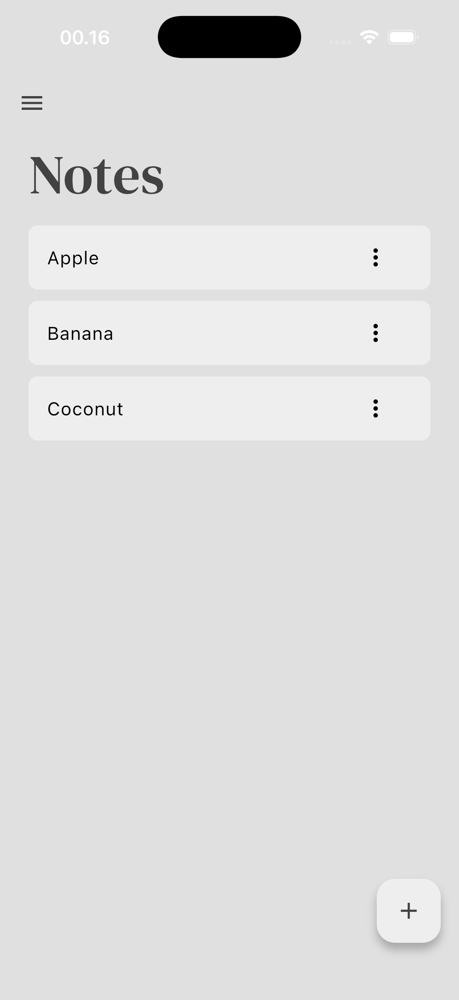
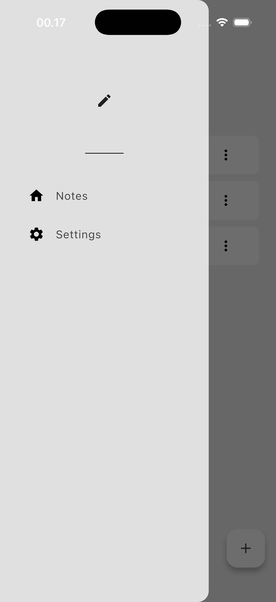
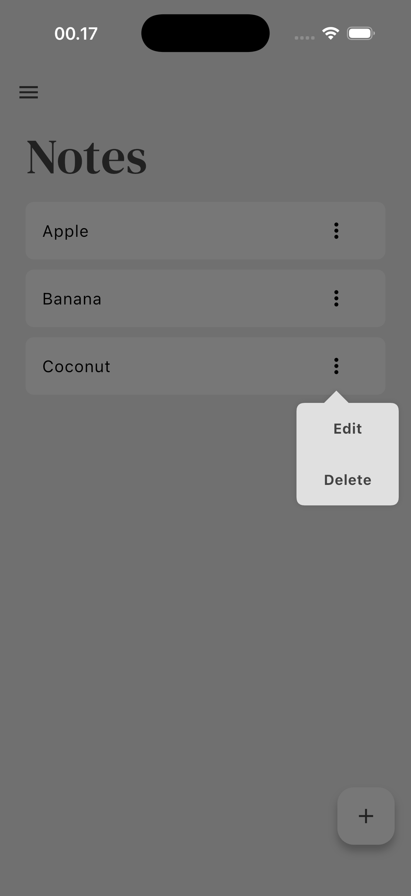
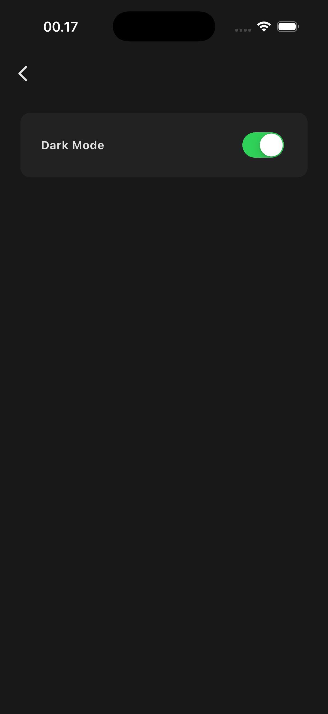
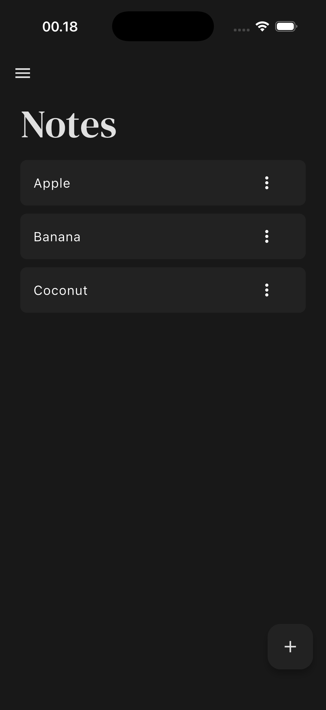

# 📝 Notes Flutter

A simple and modern notes app built with **Flutter** and **Isar database**, featuring **dark/light mode** themes.

## 🚀 Features
- Create, edit, and delete notes  
- Local data storage using **Isar DB**  
- **Dark & Light theme** support  
- Clean and responsive UI  

## 📱 App Preview
Here’s how the app looks:

<p align="center">
  
  
  
  
  
</p>

## 🧠 Tech Stack
- **Flutter**
- **Dart**
- **Isar Database**
- **Provider**
- **Material Design**

## ⚙️ Installation
```bash
# Clone this repository
git clone https://github.com/username/notes_flutter.git

# Navigate to the project folder
cd notes_flutter

# Get dependencies
flutter pub get

# Run the app
flutter run
